# 🎯 HCL-GUVI Buildathon: Agentic Honey-Pot - Project Summary

> **Theme:** AI for Fraud Detection & User Safety  
> **Selected Problem:** Problem Statement 2 - Agentic Honey-Pot for Scam Detection & Intelligence Extraction

---

## 📅 Timeline

| Stage | Start Date | End Date | Status |
|-------|------------|----------|--------|
| Problem Selection | 17 Jan 2026, 01:15 PM | 05 Feb 2026, 11:59 PM | ✅ Qualified |
| API Endpoint Tester | Available Now | 05 Feb 2026, 11:59 PM | 🟡 Active |
| API Endpoint Submission | 25 Jan 2026, 12:00 AM | 05 Feb 2026, 11:59 PM | 🟡 Active |

**⏰ Final Deadline: February 5, 2026, 11:59 PM**

---

## 📦 Deliverables Checklist

### Must Build

- [ ] **Public REST API Endpoint**
  - Publicly accessible URL
  - Secured with API key (`x-api-key` header)
  - Low latency and stable responses

- [ ] **Scam Detection Module**
  - Analyze incoming messages for scam intent
  - Support multiple scam types (bank fraud, UPI fraud, phishing, fake offers)
  - No false exposure of detection

- [ ] **Autonomous AI Agent (Honeypot)**
  - Handle multi-turn conversations
  - Maintain believable human-like persona
  - Adaptive conversation flow
  - Self-correction capabilities

- [ ] **Intelligence Extraction System**
  - Extract bank account numbers
  - Extract UPI IDs
  - Extract phishing links/URLs
  - Extract phone numbers
  - Identify suspicious keywords

- [ ] **Final Result Callback Integration**
  - POST results to GUVI evaluation endpoint
  - Include all extracted intelligence

### Must Submit

| Item | Description |
|------|-------------|
| API Endpoint URL | Your deployed public API URL |
| API Key | Authentication key for your endpoint |

---

## 🔄 System Flow Diagram

```mermaid
flowchart TD
    subgraph GUVI["🏢 GUVI Platform"]
        MS[Mock Scammer API]
        EVAL[Evaluation System]
        CB[Callback Endpoint]
    end

    subgraph YOUR_SYSTEM["🛠️ Your Honeypot System"]
        API[REST API Endpoint]
        AUTH[API Key Auth]
        SD[Scam Detection Module]
        AGENT[AI Agent - Honeypot]
        IE[Intelligence Extraction]
        SESSION[Session Manager]
    end

    MS -->|"1️⃣ Send scam message"| API
    API --> AUTH
    AUTH -->|"2️⃣ Validate"| SD
    SD -->|"3️⃣ Scam detected?"| DECISION{Scam?}
    
    DECISION -->|No| RESPONSE1[Return: scamDetected=false]
    DECISION -->|Yes| AGENT
    
    AGENT -->|"4️⃣ Generate human-like response"| SESSION
    SESSION -->|"5️⃣ Track conversation"| AGENT
    AGENT -->|"6️⃣ Continue engagement"| IE
    
    IE -->|"7️⃣ Extract intelligence"| RESPONSE2[Return JSON Response]
    
    RESPONSE2 -->|"8️⃣ API Response"| MS
    
    IE -->|"9️⃣ Engagement complete"| CALLBACK[Prepare Final Payload]
    CALLBACK -->|"🔟 POST final result"| CB
    
    CB --> EVAL
    EVAL -->|"Score submission"| RESULT[📊 Final Score]

    style GUVI fill:#e1f5fe
    style YOUR_SYSTEM fill:#fff3e0
    style DECISION fill:#ffeb3b
    style RESULT fill:#4caf50,color:#fff
```



---

## 📨 API Request/Response Flow


---

## 🔐 API Specifications

### Authentication Header
```http
x-api-key: YOUR_SECRET_API_KEY
Content-Type: application/json
```

### Input Format (Request Body)
```json
{
  "sessionId": "unique-session-id",
  "message": {
    "sender": "scammer",
    "text": "Message content",
    "timestamp": "2026-01-21T10:15:30Z"
  },
  "conversationHistory": [],
  "metadata": {
    "channel": "SMS",
    "language": "English",
    "locale": "IN"
  }
}
```

### Output Format (Response)
```json
{
  "status": "success",
  "scamDetected": true,
  "engagementMetrics": {
    "engagementDurationSeconds": 420,
    "totalMessagesExchanged": 18
  },
  "extractedIntelligence": {
    "bankAccounts": [],
    "upiIds": [],
    "phishingLinks": []
  },
  "agentNotes": "Summary of scammer tactics"
}
```

---

## 📤 Submission Process


### Step-by-Step Submission Guide

1. **Build Your Solution**
   - Implement scam detection
   - Build AI agent for conversation
   - Implement intelligence extraction
   - Add GUVI callback integration

2. **Deploy to Cloud**
   - Deploy to any cloud provider (AWS, GCP, Azure, Heroku, Railway, etc.)
   - Ensure endpoint is **publicly accessible**
   - Configure API key authentication

3. **Test Using Endpoint Tester**
   - Go to "Agentic Honey-Pot – API Endpoint Tester" on GUVI
   - Enter your API URL
   - Enter your API key
   - Click "Test Honeypot Endpoint"
   - Verify all tests pass

4. **Submit for Evaluation**
   - Go to "API Endpoint Submission for Evaluation"
   - Enter your **public API endpoint URL**
   - Enter your **API key**
   - Click "Submit Solution"

---

## 📊 Evaluation Metrics

| Metric | Description | Weight |
|--------|-------------|--------|
| **Scam Detection Accuracy** | Correctly identifying scam vs legitimate messages | High |
| **Engagement Duration** | How long the agent keeps scammer engaged | Medium |
| **Conversation Turns** | Number of messages exchanged | Medium |
| **Intelligence Quality** | Completeness of extracted data | High |
| **API Stability** | Response time and reliability | Medium |
| **Ethical Compliance** | Following guidelines | Critical |

---

## 🔗 Important URLs & Endpoints

| Purpose | URL/Endpoint |
|---------|--------------|
| Final Result Callback | `POST https://hackathon.guvi.in/api/updateHoneyPotFinalResult` |
| Problem Guidelines | [GUVI Problem Statement Page] |
| Endpoint Tester | [GUVI Honeypot Endpoint Tester] |
| Submission Portal | [GUVI API Endpoint Submission] |

---

## ⚠️ Critical Reminders

### ❗ Must Do

- ✅ API must be **publicly accessible** during evaluation
- ✅ API must accept **x-api-key** header for authentication
- ✅ Must support **multi-turn conversations** with session management
- ✅ Must call **GUVI callback endpoint** after engagement completion
- ✅ Response must match **exact JSON structure** specified
- ✅ API must handle **multiple concurrent requests**

### ❌ Don't Do

- ❌ Don't expose detection to scammer
- ❌ Don't impersonate real individuals
- ❌ Don't provide illegal instructions
- ❌ Don't harass scammers
- ❌ Don't submit without testing

---

## 🏗️ Suggested Tech Stack

| Component | Options |
|-----------|---------|
| **Backend Framework** | FastAPI (Python), Express (Node.js), Flask |
| **AI/LLM** | OpenAI GPT-4, Claude, Gemini, Local LLMs |
| **Deployment** | Railway, Render, Heroku, AWS Lambda, GCP Cloud Run |
| **Database (Session)** | Redis, MongoDB, PostgreSQL |

---

## 📝 Quick Start Checklist

```
□ Read full problem statement (PROBLEM_STATEMENT.md)
□ Set up development environment
□ Implement REST API with authentication
□ Build scam detection logic
□ Create AI agent for conversations
□ Implement intelligence extraction
□ Add session management
□ Integrate GUVI callback
□ Deploy to cloud
□ Test with GUVI Endpoint Tester
□ Submit API endpoint and key
□ Monitor during evaluation period
```

---

## 🎯 One-Line Goal

> **Deploy a secure, public API that detects scams, engages scammers with an AI agent, extracts intelligence, and reports results to GUVI for evaluation.**

---

**Good luck! 🚀**

*Last Updated: January 27, 2026*
